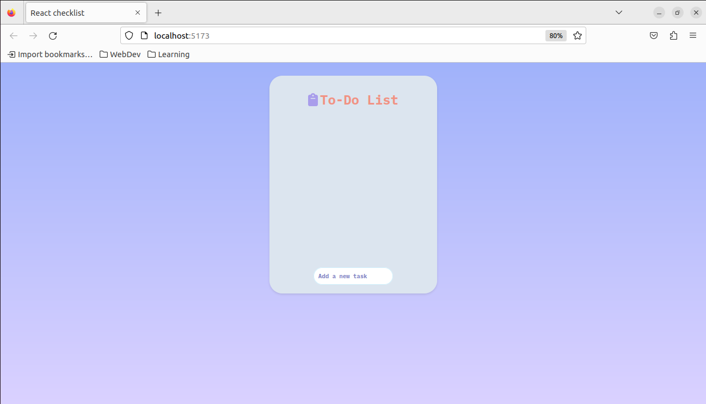
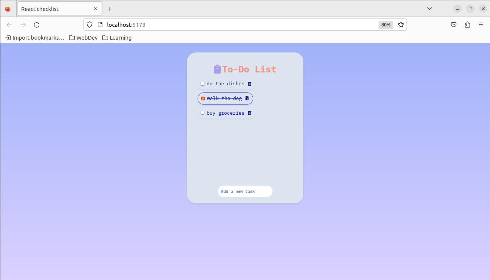
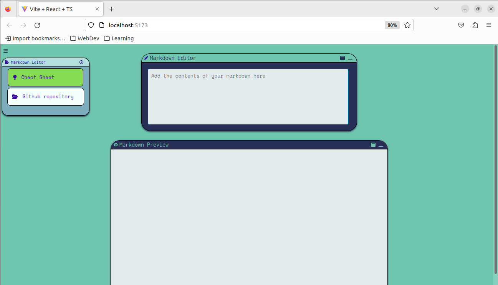
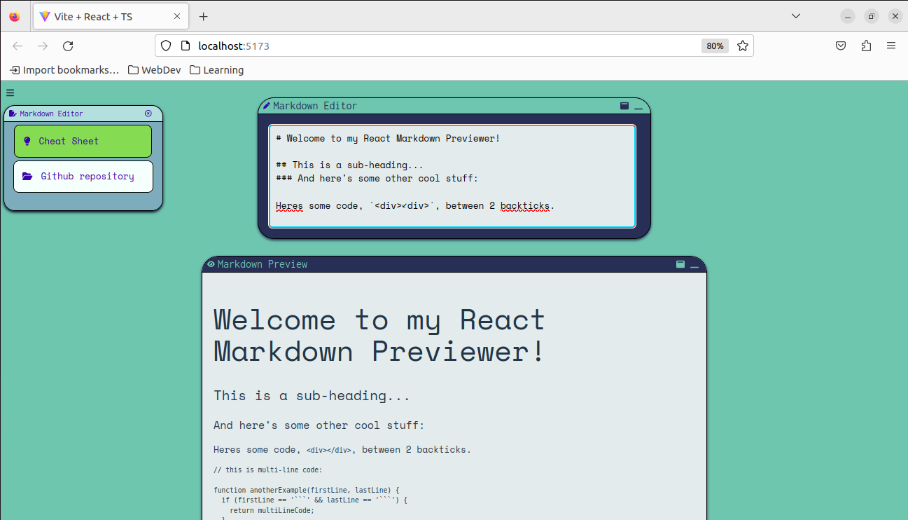

# react-projects

## About
This repository includes all the projects I have made so far to practice my React knowledge, amongst other skills

## Projects
- [Checklist](#checklist)
- [Markdown viewer](#markdown-viewer)

## About the projects
### Checklist
  The Checklist Project is a simple web application that allows users to create and manage tasks on the checklist. It provides a user-friendly interface for adding and completing tasks. To learn more details
  about this project, check its documentation [here](https://github.com/natmsaenz/react-projects/blob/main/checklist/README.md)
  - *The following pictures show what the project looks like*
  
  
  
### Markdown viewer
  The markdown viewer project is a simple web application created to edit markdown files, to have a preview of said files before using them for a project's documentation. To learn more details
  about this project, check its documentation [here](https://github.com/natmsaenz/react-projects/blob/main/markdown-viewer/README.md) 
   - *The following pictures show what the project looks like*
  
  
